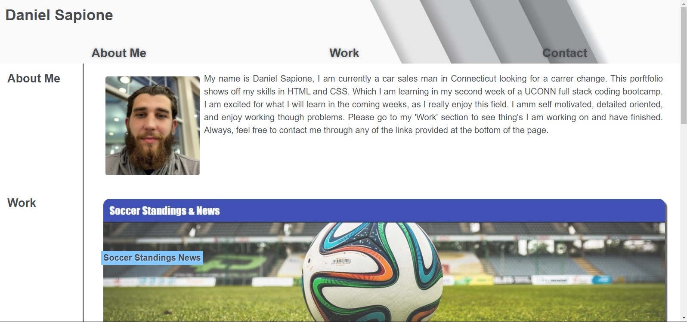

# My-Portfolio

## Purpose

A portfolio built from scratch to show my skills in HTML and CSS. The site is built to be browser accessible and have a responsive design.

## Challenges

A few main challenges I ran into were with flex and media quieries. I had difficulty getting items to fit inside the correct flex box and making it flow altogether. Once I got the website to flow on one viewport adding additional viewport caused even more trouble. With help from TA's, my tutor, and reources like W3 and MDN. I was able to get the portfolio as you see it now.

## Built With

* HTML
* CSS

## Website

<https://dsapione.github.io/My-Portfolio/>
